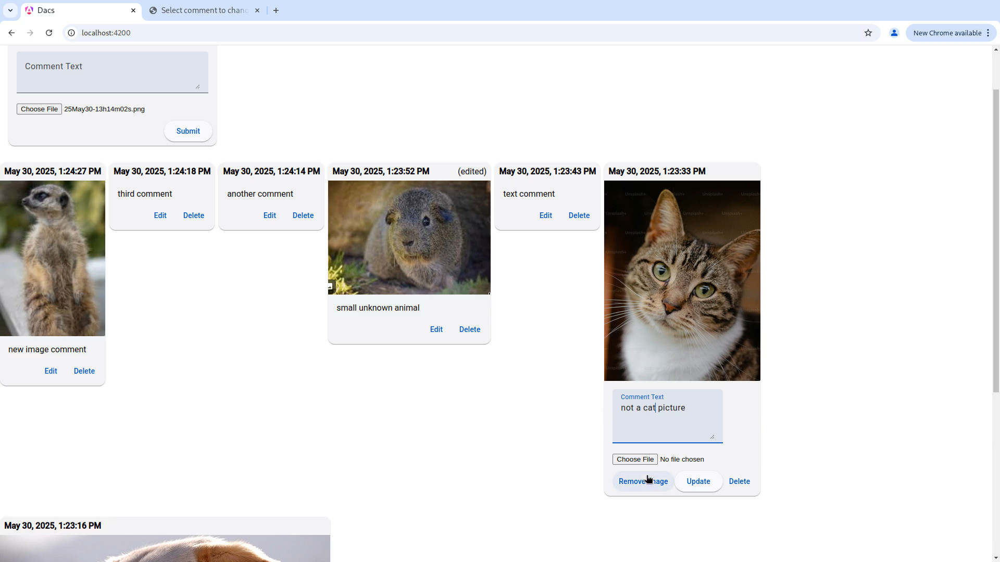

# django-angular-comment-section
This is an example/mock project to learn more about mainly angular but also some features of django. I am more interested in the backend and API's (so the backend-frontend connection) than UI/UX so I'll try to make the UI very minimal and simple but reactive so it won't feel like something I can do with plain html/css/js.

# HTTP obfuscation
TODO

## Demo (click or hover to see video)
[](https://github.com/vrpT14s/django-angular-comment-section/issues/1#issue-3102428618)

## Instructions to run locally
TODO: instructions for minio
You can use the startup script:

```./startservers.sh```

or do it manually (see below). In eithercase the website will be at http://localhost:4200/

The startup script starts the servers in the background so it might be difficult to kill them (you'll have to use ```killall``` or ```pidof``` with ```kill```).

To start it manually, you have to start the django server (it'll be at http://localhost:8000)

```cd backend && ./manage.py runserver```

and the angular server (which will be at http://localhost:4200)

```cd frontend/dacs && npm install && ng serve```

(I am not sure exactly if you need to do npm install).

## Database Design
Only one table that has text, an image and a timestamp.

I'm going to avoid having any users because that'll complicate things too much for no reason and won't have an effect on angular.

## Frontend Design
There are 2 components other than the root app component: comment and comment-form. Comment-form is for new comments and comment is for the editable ones you see everywhere else. I used angular material, mat-cards specifically, for the UI elements.

After updating a comment to remove an image, there's a bit of lag where the previous image flashes. Not sure how to fix that. In general the timing was hard to get used to.

I know new angular recommends signals instead of @Input but I only found that out after I wrote everything with @Input.

## Backend Design
This is a simple app so there's almost no backend except for sorting the comments so we get the latest comments first.

## API's
I use django rest framework to automatically make all 4 crud api endpoints. I should enable pagination for viewing as well.
